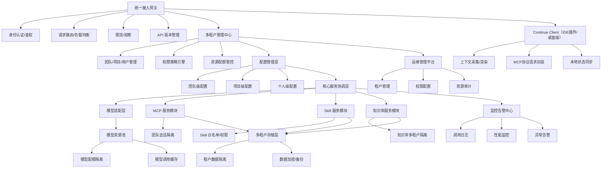
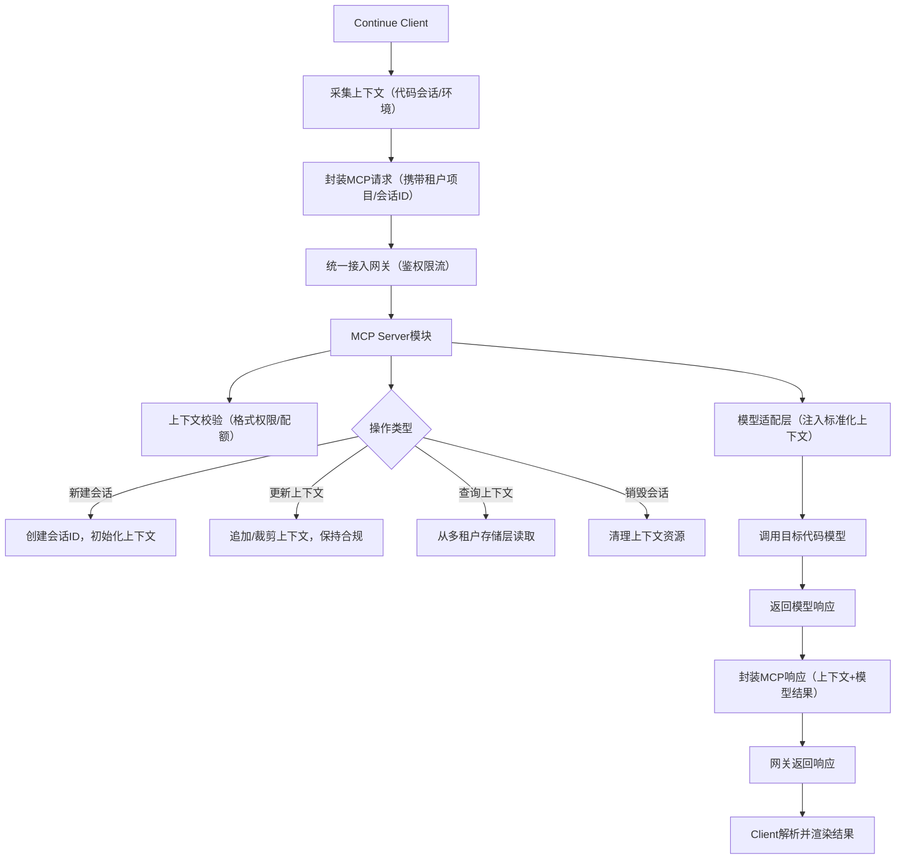

# 面向Continue的扩展服务项目建设文档

# 一、项目概述

## 1.1 项目目标

构建一套面向团队项目使用的Continue扩展服务，提供MCP（Model Context Protocol）服务、知识库服务及模型原生不支持的Skill能力，支持自由切换任意代码模型，满足团队协作中的AI编程辅助需求，同时保障多租户隔离、权限管控、高可用及可运维性。

## 1.2 核心需求

- 功能需求：提供MCP上下文管理、知识库检索、扩展Skill能力，支持GPT、Claude、CodeLlama等任意代码模型切换。

- 团队适配需求：支持多团队/项目资源隔离、细粒度权限管控、资源配额限制、统一配置管理。

- 技术选型需求：基于SpringBoot 3 + JDK 17开发，兼容Continue官方MCP协议，无语言绑定限制。

- 非功能需求：满足多人并发调用、高可用、可观测性、弹性扩容及数据安全需求。

## 1.3 适用范围

本项目适用于团队级AI编程协作场景，支撑Continue客户端（IDE插件/桌面端）接入，为开发团队提供标准化、可管控的AI辅助服务，覆盖代码生成、上下文联动、知识库复用、扩展能力执行等核心场景。

# 二、总体架构设计

## 2.1 架构设计原则

- 模块化解耦：MCP、Skill、知识库、模型适配层独立设计，降低耦合，便于扩展维护。

- 模型无关性：抽象统一模型调用接口，切换模型无需修改核心业务逻辑。

- 多租户隔离：按团队/项目维度隔离数据、配置、资源，避免交叉影响。

- 细粒度权限：基于RBAC模型划分角色权限，管控各模块操作范围。

- 高可用弹性：集群化部署、熔断降级、弹性扩容，支撑并发调用，避免单点故障。

- 可观测可运维：覆盖日志、监控、告警，支持资源审计与问题排查。

- 协议兼容性：严格遵循Continue官方MCP协议，确保与客户端无缝对接。

## 2.2 整体架构图

## 2.3 核心模块定位

|模块名称|核心定位|关键职责|
|---|---|---|
|统一接入网关|服务入口层|身份认证、请求路由、限流熔断、API版本管理、负载均衡|
|多租户管理中心|团队管控核心|租户/项目/用户层级管理、权限策略、资源配额管控|
|配置管理层|配置中枢|团队/项目/个人分层配置，覆盖模型、服务开关、规则定义|
|核心服务协调层|服务调度中枢|协调MCP、Skill、知识库模块，对接模型适配层，处理请求流转|
|模型适配层|模型兼容层|抽象统一模型接口，屏蔽API差异，支持多模型自由切换|
|MCP服务模块|上下文管理核心|会话上下文生命周期管理、标准化处理、多租户隔离存储|
|Skill服务模块|扩展能力载体|插件化Skill注册、触发执行、权限管控、白名单管理|
|知识库服务模块|知识供给层|文档解析、向量存储、相似检索、多租户知识库隔离|
|多租户存储层|数据持久化层|按租户隔离存储数据，支持加密、备份、迁移|
|监控告警中心|可观测核心|调用日志采集、性能监控、异常告警、数据统计|
|运维管理平台|运维操作入口|租户管理、权限配置、资源审计、配额调整|
# 三、核心模块详细设计

## 3.1 MCP服务模块设计（Client-Server架构）

### 3.1.1 角色定位

- MCP Client端：载体为Continue客户端（IDE插件/桌面端），负责上下文采集、协议请求封装、响应解析与渲染、本地状态同步。

- MCP Server端：集成于扩展服务，负责上下文生命周期管理、标准化处理、多租户隔离、与模型层联动，兼容Continue官方MCP协议。

### 3.1.4 客户端适配与用户体验优化

贴合现代化项目“以用户为中心”的诉求，优化开发者使用体验，降低学习成本：

- 多IDE版本兼容：适配VSCode、IntelliJ IDEA、PyCharm等主流IDE的Continue插件，确保上下文采集、服务调用、结果渲染的一致性，避免因IDE差异导致功能异常。

- 操作简化与反馈：客户端支持“一键关联项目”，自动匹配租户/项目配置，无需手动输入；服务调用失败时，返回结构化错误提示（含错误码、排查建议），而非原始异常信息，降低问题定位难度。

- 本地缓存与离线支持：客户端缓存常用知识库内容、个人配置、近期会话上下文，网络波动时可访问本地缓存；支持离线模式下的基础上下文管理，网络恢复后自动同步至Server端。

- 个性化配置同步：开发者的模型偏好、上下文裁剪规则、检索过滤条件等个性化配置，同步至服务端存储，多端登录时自动同步，保持操作习惯一致性。

- MCP Server端：集成于扩展服务，负责上下文生命周期管理、标准化处理、多租户隔离、与模型层联动，兼容Continue官方MCP协议。

### 3.1.2 交互流程

### 3.1.3 团队化增强设计

- 会话隔离：会话ID以「租户ID+项目ID」为前缀，确保数据物理隔离。

- 生命周期管控：支持团队配置会话超时时间（如闲置24小时自动销毁）、上下文大小上限，自动裁剪超限内容；进一步优化为按模型动态适配阈值（如GPT-4o 128k tokens、CodeLlama 70k tokens），同时采用上下文优先级策略，优先保留核心代码片段、最新会话及知识库关联内容，舍弃冗余环境信息。

- 上下文共享与跨端同步：支持项目级共享会话（同一项目成员可查看/复用，需权限管控），同时适配多端协同，开发者切换IDE/设备登录时，MCP会话上下文可实时同步，避免重复操作。

- 备份与归档追溯：按租户存储上下文日志，支持变更追溯与数据恢复；团队管理员可配置会话归档规则（重要项目会话手动归档、闲置会话自动归档），归档数据支持关键词检索，便于后续复盘。

## 3.2 模型适配层设计

### 3.2.1 设计理念

采用抽象基类+工厂模式，屏蔽不同代码模型的API差异，提供统一调用接口，支持动态切换模型，适配团队对多模型的使用需求。

### 3.2.2 核心能力

- 统一接口：定义代码生成、文本向量化（支撑知识库）、对话交互等通用接口。

- 模型工厂：按模型类型（GPT、Claude、CodeLlama等）创建实例，新增模型仅需实现抽象接口。

- 模型资源池：按租户分配调用配额，缓存高频请求，降低成本，支持备用模型降级切换；优化为按租户缓存分层（团队级缓存通用代码模板、项目级缓存专属业务代码、个人级缓存自定义prompt），配置缓存失效规则（模型版本更新、代码模板迭代时主动清空对应缓存）。

- 模型健康度管理：定期对模型做心跳检测、响应延迟统计、成功率监控，生成健康度报告，健康度低于阈值时自动切换至备用模型，保障服务稳定性。

## 3.3 Skill服务模块设计

### 3.3.1 设计理念

采用插件化架构，支持Skill注册/注销，通过白名单、权限管控、执行范围限制，补充模型原生不支持的能力，适配团队安全使用需求。

### 3.3.2 核心特性

- 插件化注册：通过抽象基类定义Skill规范，新增能力（如命令执行、Git操作、文件解析）仅需实现子类并注册。

- 安全管控机制：团队管理员配置Skill白名单，禁用危险Skill；高危操作需项目负责人审批，执行范围绑定项目目录；新增Skill操作沙箱，限制危险Skill的操作边界（仅允许访问项目指定目录，禁止系统级命令），建立操作审计黑名单，拦截恶意参数。

- 日志追溯：所有Skill执行记录按租户留存，高危操作留存快照，支持审计、故障回溯与问题排查。

- 并发与版本管控：通过分布式锁控制Skill并发执行（同一Skill最多3个并发实例），避免冲突；支持Skill版本管理、灰度部署（仅对指定租户/用户开放）与A/B测试，异常时可快速下线回滚。

## 3.4 知识库服务模块设计

### 3.4.1 分层结构

支持三层知识库架构，满足团队不同场景的知识复用需求：

- 团队公共知识库：全团队可见，存储通用技术文档、规范手册。

- 项目专属知识库：绑定具体项目，存储项目文档、接口说明、业务逻辑。

- 个人私有知识库：仅本人可见，存储个人笔记、代码片段。

### 3.4.2 核心能力

- 文档处理：支持从代码仓库、Confluence等平台自动同步文档，解析为可检索格式；优化为增量同步机制，仅同步更新内容，减少耗时，多人修改同一文档时，按时间戳+作者权限合并，保留修改记录。

- 向量检索：通过向量数据库（Milvus/Chroma）存储知识，实现相似内容快速检索；支持检索结果排序（按相关性、更新时间）、过滤（按文档类型、权限范围），检索失败时降级为关键词检索。

- 权限管控：团队管理员审核知识库内容，控制读写权限，避免敏感信息泄露；对只读用户配置数据脱敏规则，隐藏密钥、内网地址等敏感信息。

- 版本管理：支持文档版本追溯与回滚，记录修改历史，关联修改人及操作时间。

## 3.5 多租户与权限设计

### 3.5.1 多租户隔离机制

采用“租户ID+资源前缀”模式，覆盖数据、配置、资源全维度隔离：

- 数据隔离：存储层以租户/项目ID为前缀划分数据，物理隔离避免泄露；补充数据全生命周期管控，敏感字段（API密钥、涉密知识库内容）采用字段级加密，Redis缓存数据加密，明确备份保留周期与销毁流程。

- 配置隔离：每个租户拥有独立配置命名空间，个人配置仅覆盖本租户内维度；支持配置热更新，修改团队/项目配置无需重启服务，同时保留配置版本历史，支持回滚至历史版本。

- 资源隔离：模型调用配额、Skill执行资源按租户分配，互不干扰，支持网络隔离（可选）；新增资源动态调整机制，可按时间段（工作时间/非工作时间）自动调整配额，配额使用达80%时触发预警。

### 3.5.2 权限体系（RBAC模型）

|角色|核心权限|
|---|---|
|平台管理员|管理所有租户、分配全局资源配额、配置全局规则（如禁用危险Skill）、管控跨团队资源授权、维护协议版本适配规则|
|团队管理员|管理本团队项目/用户、配置团队级规则、查看资源使用日志、调整项目权限、配置会话归档与缓存规则|
|项目负责人|管理本项目知识库、配置项目级模型/Skill规则、审批高危操作、管理项目成员权限、管控Skill灰度发布范围|
|普通开发者|使用分配的模型/知识库/Skill、修改个人配置、查看本人操作日志、参与项目级会话共享|
|只读用户|查看知识库/MCP会话（敏感信息脱敏），无执行Skill、修改配置权限|
### 3.5.3 跨团队资源授权

支持跨团队协作场景，平台管理员可配置资源共享规则：团队管理员发起共享申请（如共享团队公共知识库、通用Skill），目标团队管理员审批通过后，授予指定角色访问权限；共享资源仅开放只读/有限使用权限，避免跨团队数据篡改，同时留存共享授权日志，支持追溯与回收。

### 3.5.4 租户与用户的核心区别

租户与用户为层级归属关系，分别对应组织与个体维度，核心差异体现在资源归属、隔离边界等方面，具体对比如下：

|维度|租户（Tenant）|用户（User）|
|---|---|---|
|核心定义|组织/团队级隔离单元（如公司、部门、项目组）|租户内的个体使用者（如开发者、管理员）|
|资源归属|拥有独立资源池（模型配额、知识库、配置），供租户内用户共享|无独立资源，仅可使用所属租户分配的资源|
|隔离边界|跨租户完全隔离（数据、配置、资源互不干扰）|同租户内按角色区分权限，跨租户无直接关联|
|生命周期|由平台管理员创建/注销，与团队组织架构同步|由租户管理员在所属租户内创建/禁用，依附于租户存在|
|核心作用|划定权限顶层边界，实现多团队资源隔离与管控|执行具体操作，通过角色绑定获取租户内操作权限|
### 3.5.5 租户、用户与权限体系的绑定逻辑

基于“租户→角色→用户”三层绑定关系，结合RBAC模型实现精细化权限管控，确保权限范围与租户边界强关联，具体逻辑如下：

- 租户作为权限隔离顶层边界：权限体系先以租户为单位划分“权限池”，每个租户仅能管控本租户内资源，杜绝跨租户权限渗透。平台管理员拥有全局管控权限，可分配资源配额、配置跨租户共享规则；租户内管理员仅能操作本租户资源与用户权限，无跨租户权限。

- 角色作为权限与用户的中间桥梁：系统预设的5类角色（平台管理员、团队管理员等）均与租户强绑定，角色权限为“最小权限集合”，仅包含岗位职责所需操作权限（如普通开发者无配置修改权限）。其中平台管理员为租户无关角色，其余角色均归属具体租户，权限范围限定在租户内。

- 用户与角色的绑定规则：单个用户仅能归属一个租户（避免权限混乱），可在租户内绑定多个角色（如同时为A项目负责人、B项目普通开发者），最终权限为多个角色权限的集合。用户权限 = 所属租户的资源范围 + 绑定角色的操作权限，确保操作范围不超出租户边界与角色权限。

业务绑定示例：平台管理员创建“租户A（研发一部）”并分配资源；租户A管理员创建用户“张三”，绑定“项目负责人”角色并指定负责“项目X”；张三自动获得租户A的资源使用权限+项目负责人权限，可管理项目X知识库、审批高危Skill，且无法访问其他租户资源；若张三调至其他租户，需先在租户A禁用账号，再在新租户创建账号并绑定角色，原权限自动失效。

支持跨团队协作场景，平台管理员可配置资源共享规则：团队管理员发起共享申请（如共享团队公共知识库、通用Skill），目标团队管理员审批通过后，授予指定角色访问权限；共享资源仅开放只读/有限使用权限，避免跨团队数据篡改，同时留存共享授权日志，支持追溯与回收。

# 四、技术选型

## 4.1 核心技术栈

|技术领域|技术选型|选型说明|
|---|---|---|
|开发框架|SpringBoot 3 + JDK 17|适配团队技术栈，支持虚拟线程、ZGC垃圾回收，生态完善，便于集成权限、监控组件|
|API网关|Spring Cloud Gateway|支持路由、限流、熔断、认证，与Spring生态无缝集成|
|权限管理|Spring Security + OAuth2|实现细粒度权限管控、身份认证，支持多端对接|
|数据存储|PostgreSQL + Redis + Milvus|PostgreSQL存储结构化数据（租户/权限/配置）；Redis缓存会话、高频请求；Milvus存储知识库向量数据|
|熔断降级|Resilience4j|轻量级组件，适配SpringBoot 3，支持熔断、限流、降级|
|监控告警|Prometheus + Grafana + AlertManager|实现性能监控、指标统计、异常告警，支撑运维决策|
|日志管理|ELK Stack|采集、分析、存储调用日志，支持问题追溯与审计|
|部署环境|Kubernetes + Docker|支持服务集群化、弹性扩缩容，便于团队运维管理|
## 4.2 模型适配说明

支持GPT、Claude、CodeLlama、通义千问等任意代码模型，通过模型适配层抽象接口，屏蔽API差异：

- 公有模型（GPT/Claude）：通过官方API调用，适配密钥管理与配额控制。

- 私有模型（CodeLlama）：部署在团队内网集群，通过内部接口对接，保障数据安全。

## 4.3 MCP协议适配说明

Continue官方MCP协议以RESTful接口为主，无语言绑定，SpringBoot服务需实现以下核心接口（按官方规范）：

- POST /api/mcp/v1/sessions：创建MCP会话，传入租户ID、项目ID、初始上下文。

- PUT /api/mcp/v1/sessions/{sessionId}：更新会话上下文，传入操作类型、上下文内容。

- GET /api/mcp/v1/sessions/{sessionId}：查询指定会话的上下文内容。

- DELETE /api/mcp/v1/sessions/{sessionId}：销毁会话，清理上下文资源。

跨语言兼容：通过Jackson统一JSON序列化规则，适配Python Client与Java Server的数据交互（如None对应null、dict对应Map），避免使用Java特有数据类型直接序列化。

### 4.4 协议版本适配保障

针对Continue官方MCP协议迭代风险，建立多版本兼容机制：

- 支持多版本MCP协议共存，新增协议版本适配层，通过API版本管理区分不同协议请求，应对官方协议升级。

- 定期同步Continue官方协议更新，提前预留适配接口，避免协议变更导致服务中断。

- 开发协议兼容性测试工具，自动化校验接口参数、响应格式一致性，纳入CI/CD流程。

### 4.5 安全组件补充选型

|安全领域|技术选型|选型说明|
|---|---|---|
|数据加密|AES-256 + 密钥管理服务（KMS）|对敏感字段、备份数据加密，密钥通过KMS统一管理，避免硬编码泄露|
|接口防刷|Sentinel + Redis分布式限流|精细化控制单用户/IP请求频率，识别异常请求特征，支持临时封禁|
|Skill沙箱|Docker容器沙箱|隔离危险Skill执行环境，限制资源占用与操作范围，避免影响主服务|
# 五、部署架构设计

## 5.1 部署分层

1. 接入层：部署Spring Cloud Gateway集群，对外暴露统一域名，负责认证、路由、限流。

2. 应用层：核心服务（多租户中心、配置管理、MCP/Skill/知识库模块）部署为K8s集群，支持弹性扩缩容。

3. 模型层：公有模型通过API调用，私有模型部署在内网集群，与应用层网络隔离。

4. 存储层：PostgreSQL主从集群（结构化数据）、Redis集群（缓存）、Milvus集群（向量数据），按租户分片存储。

5. 运维层：部署Prometheus、Grafana、ELK、AlertManager，实现监控、日志、告警一体化。

## 5.2 高可用保障

- 服务集群化：核心服务多实例部署，避免单点故障，网关负载均衡分发请求。

- 熔断降级与依赖容错：模型调用超时/失败时，自动切换到备用模型；向量数据库、Redis等组件故障时，降级为本地缓存；通过Resilience4j配置熔断阈值，故障恢复后自动恢复连接。

- 数据备份与安全：按租户定时备份核心数据，支持跨区域备份，备份文件加密存储，明确备份保留周期与销毁流程；核心数据（MCP上下文、知识库）按生命周期自动清理过期内容。

- 弹性扩容：基于QPS、CPU使用率等指标，自动扩容/缩容服务实例，适配并发波动；按租户分配资源，避免单租户过度占用资源。

- 精细化接口防护：网关层新增接口防刷机制，通过Sentinel+Redis实现单用户/IP请求频率管控，识别恶意请求特征（如高频重复调用、异常参数），触发阈值后临时封禁，同时拦截SQL注入、XSS等攻击。

- 服务集群化：核心服务多实例部署，避免单点故障，网关负载均衡分发请求。

- 熔断降级与依赖容错：模型调用超时/失败时，自动切换到备用模型；向量数据库、Redis等组件故障时，降级为本地缓存；通过Resilience4j配置熔断阈值，故障恢复后自动恢复连接。

- 数据备份与安全：按租户定时备份核心数据，支持跨区域备份，备份文件加密存储，明确备份保留周期与销毁流程；核心数据（MCP上下文、知识库）按生命周期自动清理过期内容。

- 弹性扩容：基于QPS、CPU使用率等指标，自动扩容/缩容服务实例，适配并发波动；按租户分配资源，避免单租户过度占用资源。

- 精细化接口防护：网关层新增接口防刷机制，通过Sentinel+Redis实现单用户/IP请求频率管控，识别恶意请求特征（如高频重复调用、异常参数），触发阈值后临时封禁，同时拦截SQL注入、XSS等攻击。

- 业务级监控：补充租户维度指标（各租户模型调用量、Skill执行成功率、知识库检索命中率）、业务健康度指标（MCP会话创建成功率、上下文同步延迟），集成到Grafana面板，支撑资源优化与问题定位。

- 云原生特性深化：基于K8s实现服务网格（Istio）部署，管控服务间流量、实现灰度发布、熔断降级的精细化配置；利用K8s HPA（Horizontal Pod Autoscaler）结合自定义指标（如模型调用QPS）实现弹性扩缩容，提升资源利用率；通过PersistentVolumeClaim（PVC）动态申请存储，适配租户数据增长需求。

- 全链路追踪：集成OpenTelemetry实现分布式追踪，串联MCP会话、模型调用、Skill执行、知识库检索等全流程，生成追踪链路图，快速定位跨服务调用的性能瓶颈与异常点，融入Grafana监控面板。

## 5.3 部署保障方案

### 5.3.1 部署前置条件与环境检查清单

- 硬件要求：CPU≥8核、内存≥16G（生产环境），硬盘≥100G（存储日志与备份数据）。

- 软件版本：Kubernetes≥1.24、Docker≥20.10、JDK17（ZGC启用）、PostgreSQL≥14、Redis≥6.2、Milvus≥2.2。

- 环境配置：配置JDK17环境变量，关闭防火墙不必要端口，开放服务端口（网关80/443、应用8080、监控9090）；设置时区为UTC，确保日志时间一致性。

- 依赖检查：提前校验各组件兼容性，测试模型API密钥连通性、向量数据库集群可用性。

### 5.3.3 DevOps一体化集成方案

贴合现代化项目持续交付需求，构建“开发-测试-部署-运维”全流程自动化体系：

- CI/CD流水线集成：基于GitLab CI/Jenkins搭建自动化流水线，实现代码提交触发构建、单元测试、镜像打包、镜像扫描（漏洞检测）、自动部署至测试环境，全量发布前需人工审批，确保代码质量与安全。

- 配置管理自动化：采用GitOps模式，通过ArgoCD将配置文件（K8s YAML、应用配置）与代码同步管理，配置变更自动触发应用更新，避免“配置漂移”，同时留存配置变更记录，支持回滚。

- 环境一致性保障：通过Docker容器标准化部署环境，开发、测试、生产环境使用相同镜像版本；借助Terraform实现基础设施即代码（IaC），自动化创建K8s集群、存储、网络等资源，减少人工操作误差。

- 自动化测试嵌入：流水线中集成协议兼容性测试、接口自动化测试、压力测试（JMeter），测试不通过则阻断部署流程；定期执行全链路压测，验证服务在高并发场景下的稳定性。

- 硬件要求：CPU≥8核、内存≥16G（生产环境），硬盘≥100G（存储日志与备份数据）。

- 软件版本：Kubernetes≥1.24、Docker≥20.10、JDK17（ZGC启用）、PostgreSQL≥14、Redis≥6.2、Milvus≥2.2。

- 环境配置：配置JDK17环境变量，关闭防火墙不必要端口，开放服务端口（网关80/443、应用8080、监控9090）；设置时区为UTC，确保日志时间一致性。

- 依赖检查：提前校验各组件兼容性，测试模型API密钥连通性、向量数据库集群可用性。

### 5.3.2 灰度部署与回滚策略

- 灰度部署：分三阶段发布，第一阶段覆盖测试团队，验证功能与兼容性；第二阶段覆盖10%生产用户，监控服务稳定性；第三阶段全量发布。

- 版本管理：为每版服务打上唯一版本标记，关联配置文件与依赖版本，留存版本变更记录。

- 回滚机制：设置回滚触发条件（错误率≥1%、响应延迟≥5s、服务不可用时长≥30s），触发后自动回滚至前一稳定版本；支持手动触发回滚，回滚过程中保障现有会话不中断。

# 六、团队协作流程适配

1. 项目初始化：平台管理员创建团队，分配模型配额与资源，任命团队管理员。

2. 团队配置：团队管理员创建项目，绑定专属知识库，配置允许使用的Skill与默认模型，添加项目成员并分配角色。

3. 日常使用：开发者通过Continue客户端接入服务，自动关联所属项目的配置，使用模型、知识库、Skill能力，服务自动管控权限与配额。

4. 运维监控：团队管理员通过运维平台查看资源使用情况、操作日志，调整配额与权限，处理异常告警。

5. 审计追溯：管理员可按租户/项目/用户维度，追溯模型调用、Skill执行、知识库修改记录，满足合规需求。

# 七、风险与应对措施

|风险点|应对措施|
|---|---|
|模型调用配额超支|按租户配置配额上限，超限时触发告警并限制调用，支持动态调整配额；提供配额使用统计面板，提前预警资源不足。|
|数据安全泄露（租户数据/知识库敏感信息）|1. 传输层：全链路HTTPS加密，禁止明文传输MCP上下文与知识库内容；2. 存储层：敏感字段采用AES-256加密，Redis缓存数据加密，通过KMS统一管理密钥；3. 访问层：配置数据脱敏规则，只读用户查看时隐藏敏感信息；4. 操作层：留存数据访问与修改日志，异常访问触发告警。|
|MCP协议兼容性风险（官方协议迭代）|建立多版本协议共存机制，新增适配层区分协议版本；定期同步官方更新，预留适配接口；开发自动化兼容性测试工具，纳入CI/CD流程，提前发现适配问题。|
|Skill执行安全风险（恶意调用/越权操作）|通过Docker容器沙箱隔离执行环境，限制操作范围；配置Skill白名单与黑名单，拦截恶意参数；高危操作需审批并留存快照；分布式锁控制并发执行，避免资源竞争。|
|服务依赖故障（模型API/向量数据库不可用）|模型API故障时自动切换至本地备用模型，向量数据库故障时降级为本地缓存；部署依赖组件备用实例（Redis主从、Milvus副本），实现故障自动切换；配置熔断降级规则，避免依赖故障蔓延。|
|接口恶意调用与资源耗尽|- 日志管理：ELK Stack采集全链路日志，按“租户-项目-用户”分层标记，日志保留周期为30天，核心操作日志（权限变更、高危Skill执行）保留90天，支持按关键词、时间范围检索。 - 告警策略：设置多级告警阈值（警告、严重、紧急），覆盖性能异常、资源超支、服务故障等场景；告警渠道支持邮件、企业微信，紧急告警联动运维人员电话通知。 - 定期巡检：每日自动化巡检服务可用性、组件健康度、数据备份完整性；每周生成运维报告，分析资源使用趋势与潜在风险。 - 监控面板分层设计：按角色提供差异化监控面板——运维视角（全服务性能、集群状态、告警汇总）、团队管理员视角（本团队资源使用、权限变更、异常操作）、开发者视角（个人调用日志、接口成功率），满足不同角色监控需求。|
# 八、项目落地补充说明

## 8.1 运维管理细则

- 日志管理：ELK Stack采集全链路日志，按“租户-项目-用户”分层标记，日志保留周期为30天，核心操作日志（权限变更、高危Skill执行）保留90天，支持按关键词、时间范围检索。

- 告警策略：设置多级告警阈值（警告、严重、紧急），覆盖性能异常、资源超支、服务故障等场景；告警渠道支持邮件、企业微信，紧急告警联动运维人员电话通知。

- 定期巡检：每日自动化巡检服务可用性、组件健康度、数据备份完整性；每周生成运维报告，分析资源使用趋势与潜在风险。

## 8.2 扩展性规划

- 模块扩展：预留插件注册接口，新增模型、Skill时无需修改核心代码，仅需实现对应抽象接口并注册。

- 容量扩展：存储层支持动态扩容（PostgreSQL分库分表、Milvus分片），应用层支持K8s自动扩缩容，适配团队规模增长。

- 功能扩展：预留多语言适配、第三方工具集成（如Jenkins、Jira）接口，支撑后续业务场景拓展。

## 8.3 合规要求

遵循数据安全合规要求，明确数据收集、存储、使用、销毁全流程规范；留存操作审计日志，满足合规追溯需求；对跨境传输数据进行严格管控，避免违规传输；定期开展安全测评与漏洞扫描，及时修复安全隐患。

### 8.3.1 合规与安全深化方案

- 等保合规适配：按《网络安全等级保护条例》三级等保要求设计，补充身份鉴别（多因素认证）、访问控制（最小权限原则）、安全审计（全操作日志留存6个月以上）、恶意代码防范（服务器端杀毒软件部署）等措施，定期开展等保测评与整改。

- 敏感数据全流程管控：通过自动化工具扫描知识库、MCP上下文，识别身份证号、密钥、内网地址等敏感数据，自动脱敏存储；明确敏感数据跨境传输禁令，如需传输需经安全评估与审批。

- 第三方依赖安全：梳理项目依赖组件清单（SBOM），定期扫描开源组件漏洞（使用OWASP Dependency-Check），高危漏洞及时升级版本；对模型API、第三方工具集成（如Confluence）进行安全评估，签订数据安全协议。

### 8.4 成本管控方案

现代化项目需平衡性能与成本，避免资源浪费，构建精细化成本管控体系：

- 资源弹性伸缩优化：基于业务峰谷调整资源配置，工作时间（9:00-18:00）按峰值配置资源，非工作时间自动缩容至最小实例数；模型资源池按租户配额动态分配，闲置模型实例自动回收。

- 存储成本优化：知识库冷数据（3个月以上未访问）自动迁移至低成本对象存储（如S3、OSS），热数据保留在向量数据库；MCP会话归档数据采用压缩存储，定期清理过期归档（如1年以上无访问记录）。

- 成本分摊与可视化：按租户/项目统计资源占用成本（CPU、内存、存储、模型调用费用），生成成本报表，支撑团队成本核算；集成云成本管理工具（如Prometheus + Kubecost），实时监控成本趋势，超预算触发告警。

### 8.5 灾备与业务连续性计划

- 灾备指标明确：定义RPO（恢复点目标）≤1小时，RTO（恢复时间目标）≤4小时，确保极端故障下数据损失最小、服务快速恢复。

- 多区域部署：核心服务与存储采用跨区域部署（主区域+备区域），主区域故障时自动切换至备区域；数据同步采用实时增量同步，备份数据跨区域存储，避免单一区域灾难导致数据丢失。

- 灾备演练机制：每季度开展一次灾备切换演练，验证备区域服务可用性、数据一致性，优化灾备流程；演练后生成报告，整改存在的问题，持续完善灾备体系。

### 8.6 多场景适配扩展

- 离线部署模式：支持内网完全隔离场景的离线部署，提供离线安装包（含所有依赖组件、模型镜像），知识库、MCP上下文仅存储在内网，满足涉密团队数据安全需求。

- 多云适配：支持阿里云、华为云、AWS等主流公有云部署，通过Terraform适配不同云厂商的基础设施，实现“一键部署”；支持混合云架构（公有云+私有云），核心数据存储在私有云，非核心服务部署在公有云，平衡安全与弹性。

- 轻量化版本：提供轻量化部署方案，删减非核心功能（如跨团队授权、高级监控），适配小团队（10人以内）的极简部署需求，降低运维成本。
> （注：文档部分内容可能由 AI 生成）